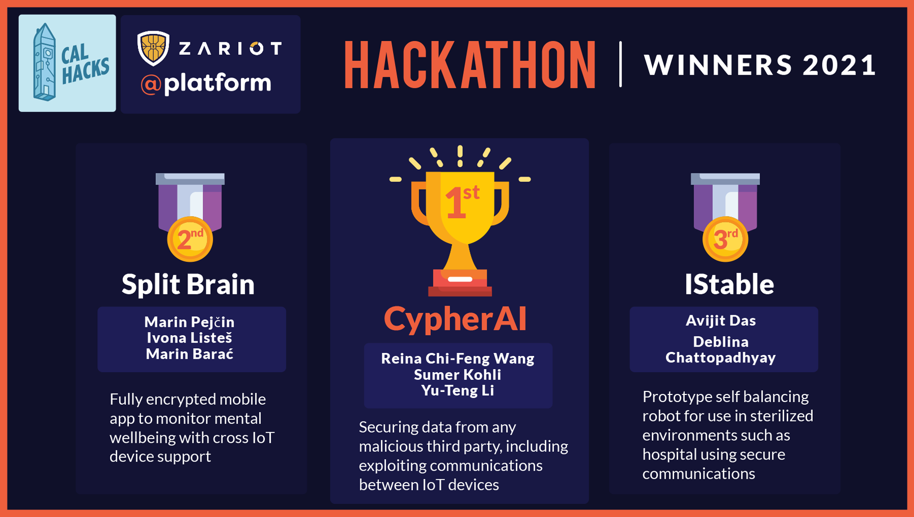

# CypherAI

**Providing secure deep learning as a service (MLaaS) to IoT devices, eliminating the tradeoff between data usability and privacy.**

:rocket: **Cal Hacks 8.0** winning project by Kevin Li, Sumer Kohli, and Reina Wang.

- Best E2E Encryption
- [1st Place] Encryption @ IoT Security Challenge
- [1st Place] Mobile Apps Post "The Social Dilemma" Challenge

